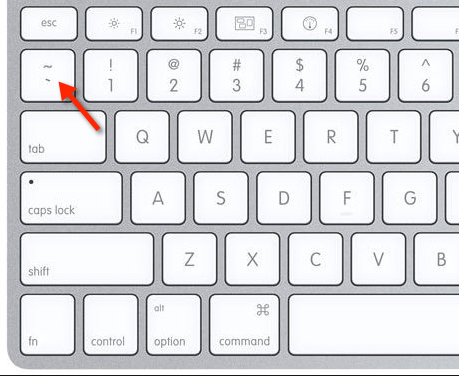
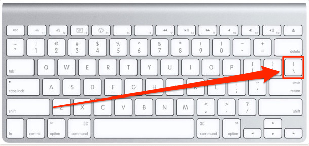

# Github Docs Example

## Step 1 - Using Codeblocks.

Codeblocks in markdown make it *very easy* for tech people to **copy, paste, share** code.
A good __Cloud Engineer__ uses Codeblocks whenever possible.

Because it allows others to copy and paste their code to replicate or research issues.

- In order to create codeblocs in markdown you need to use three backticks (`)
- Not to be confused with quotation (')

```
def factorial(n):
    if n == 0:
        return 1
    else:
        return n * factorial(n - 1)

number = 5
print("Factorial of", number, "is", factorial(number))
```

- When you can you should attempt to apply syntax highlighting to your codeblocks

``` python
def factorial(n):
    if n == 0:
        return 1
    else:
        return n * factorial(n - 1)

number = 5
print("Factorial of", number, "is", factorial(number))
```
- Make note of where the backtick keyboard key is located.
- It should appear above the tab key
- but it may vary based on your keyboard layout.



Good Cloud Engineers use codeblocks for both code and Errors that appear in the console.

```bash
Traceback (most recent call last):
  File "example.py", line 2, in <module>
    result = 10 / 0
ZeroDivisionError: division by zero

```
> Here is an example of using a codeblock for an error that appears in bash.

## Step 3 - Use Github Flavored Markdown Task Lists

Github extends Markdown to have a list where you can check off items. [<sup>[1]</sup>](#user-content-references)

- [x] Finish Step 1
- [ ] Finish Step 2
- [x] Finish Step 3

# Step 4 - Use Emojis (Optional)

Github Flavored Markdown (GFM) supports emoji shortcodes.
Here are some examples:

| Name | Shortcode | Emoji |
| --- | --- | --- |
| Cloud | `:cloud:` | ☁️ |
| Cloud with lightening| `:cloud_with_lightening:` | 🌩️ |

# Step 5 - how to create a table 

```md
| Name | Shortcode | Emoji |
| --- | --- | --- |
| Cloud | `:cloud:` | ☁️ |
| Cloud with lightening| `:cloud_with_lightening:` | 🌩️ |
```
Github extends the functionality of Markdown tables to provide more alignment and table cell formatting options. [<sup>[2]</sup>](#user-content-references)

- Make note of where the pipe keyboard key is located.
- It should appear above the return or entter key
- but it may vary based on your keyboard layout.



## References
- [GitHub Flavored Markdown Spec](https://github.github.com/gfm/)
- [Basic writing and formatting syntax](https://docs.github.com/en/get-started/writing-on-github/getting-started-with-writing-and-formatting-on-github/basic-writing-and-formatting-syntax)
- [GFM - Task Lists](https://github.github.com/gfm/#task-list-items-extension) <sup>[1]</sup>
- [GFM -Emoji CheatSheet](https://github.com/ikatyang/emoji-cheat-sheet/blob/master/README.md)
- [GFM - Tables (with extensions)](https://github.github.com/gfm/#tables-extension-) <sup>[2]</sup>
